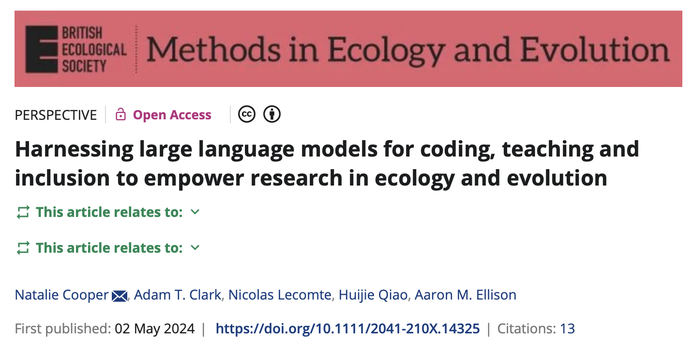

## Who Am I? {.smaller}

::: {.columns}
::: {.column width="60%"}
**Javi**

- **PhD in Zoology** from UF (quantitative ecology & disease modeling)
- **Computational Literacy Librarian** at UF Libraries
- Research background: movement ecology, statistical modeling, infectious disease
- **Passionate about reproducible science**

:::
::: {.column width="40%"}
{width=80%}
:::
:::

::: {.fragment .highlight-blue}
**Why am I here?** To help you think critically about AI as a tool in your data science toolkit
:::

---

## What is Computational Literacy? {.smaller}

::: {.incremental}
- **More than just coding** - it's understanding how to solve problems computationally
- Critical evaluation of computational tools and their outputs
- Understanding *when* and *how* to use different tools appropriately
- Building reproducible, transparent workflows
:::

::: {.fragment}
### From the Libraries Perspective

We help researchers across campus:

- Develop computational skills for their specific domains
- Navigate the evolving landscape of research tools
- Make informed decisions about adopting new technologies
:::

::: {.fragment .highlight-orange}
**LLMs are now part of this landscape** - we need to use them thoughtfully
:::

---

## LLMs and Computational Literacy

::: {.callout-note icon=false}
## Why are we talking about this?

Large Language Models (like ChatGPT, Claude, etc.) are becoming ubiquitous in research and data analysis workflows.

**Question:** Are you using them responsibly and effectively?
:::

::: {.fragment}
Part of computational literacy in 2024 means:

::: {.incremental}
- Understanding what LLMs are and aren't
- Knowing when they're helpful vs. harmful
- Being able to critically evaluate their outputs
- Integrating them into **reproducible** workflows
:::
:::

---

## 🤔 Quick Reflection {.center}

### Let's hear from you!

::: {.fragment}
**1. What do you think an LLM is?**

*Take a little time to think, then we'll share*
:::

::: {.fragment}
**2. How are you currently using LLMs?**
:::

::: {.fragment}
**3. What concerns or questions do you have about using them?**
:::

---

## What ARE Large Language Models? {.smaller}

::: {.fragment .callout-important icon=false}
## Key Concept

LLMs are **probabilistic models** trained on massive amounts of text data. They predict the most likely next word (or token) based on patterns in their training data.
:::

::: {.fragment}
### What they are NOT:

::: {}
- ❌ Databases with stored facts
- ❌ Search engines
- ❌ Thinking or reasoning entities
- ❌ Always correct or reliable
:::
:::

::: {.fragment .highlight-orange}
They are pattern-matching prediction machines
:::

---

## 🎮 Let's Play: How LLMs Work {.center}

### Interactive Exercise

I'll start a sentence, and you complete it with what feels most natural:

::: {.fragment}
**"Knock Knock... \_\_\_\_\_"**
:::

::: {.fragment}
**"The mitochondria is the...  \_\_\_\_\_"**
:::

::: {.fragment}
**"In R, to read a CSV file you use the function... \_\_\_\_\_"**
:::

::: {.fragment .highlight-orange}
This is essentially what an LLM does - but with billions of parameters and training examples!
:::

---

## LLMs as Tools for Learning & Analysis {.smaller}

::: {.columns}
::: {.column width="35%"}
### Potential Benefits
::: {.incremental}
- 📚 **Explaining concepts** in different ways
- 🐛 **Debugging code** and finding syntax errors
- 💡 **Generating ideas** for approaches to problems
- 📝 **Writing documentation** and comments
- 🔍 **Finding functions** or packages you didn't know existed
- ⚡ **Speeding up routine tasks** (boilerplate code, data cleaning patterns)
:::
:::

::: {.column width="65%"}

:::
:::

::: {.fragment}
### But...
::: {.highlight-orange}
**They work best as collaborative tools, not replacements for thinking**
:::
:::

---

## ⚠️ Things to Be Cautious About {.smaller}

::: {.columns}
::: {.column width="50%"}
### Technical Concerns

- **Hallucinations** - confidently wrong
- **Outdated information** - training data cutoffs
- **Package/function errors** - non-existent code
- **Statistical misconceptions** - plausible but wrong advice
- **Context limitations** - doesn't understand your full problem

:::
::: {.column width="50%"}
### Ethical & Learning Concerns

- **Over-reliance** - not building your own understanding
- **Data privacy** - don't share sensitive data
- **Academic integrity** - know your institution's policies
- **Reproducibility** - how do you document AI assistance?
- **Bias** - reflects biases in training data

:::
:::

::: {.fragment .highlight-red}
**Critical thinking is non-negotiable when using LLMs**
:::

---

## When NOT to Use LLMs {.smaller}

::: {.callout-warning icon=false}
## Avoid LLMs when:

::: {.incremental}
- 🎓 **Learning a concept for the first time** - you need to build intuition
- 📊 **Making statistical decisions** - you need to understand assumptions
- 🔐 **Working with sensitive/private data** - privacy concerns
- ✅ **Taking exams or assessments** - academic integrity
- 🧪 **You need to cite sources** - LLMs don't provide proper citations
- 🤔 **The stakes are high** - always verify independently
:::
:::

::: {.fragment}
### Instead, use them for:
Getting unstuck, exploring options, routine tasks, learning syntax (after understanding concepts)
:::

---

## Verification Strategies {.smaller}

### How do you know if LLM output is correct?

::: {.incremental}
1. **Run the code** - does it execute without errors?
2. **Check the logic** - does it make statistical/ecological sense?
3. **Test with simple data** - where you know the answer
4. **Consult documentation** - verify functions and arguments exist
5. **Peer review** - have someone else look at it
6. **Compare approaches** - try solving it yourself first, then compare
:::

::: {.fragment}
::: {.callout-tip icon=false}
## Rule of Thumb
If you can't explain what the code does and why it's appropriate, **don't use it**
:::
:::

---

## Reproducibility & LLM Use {.smaller}

::: {.highlight-blue}
**Big question:** How do we maintain reproducibility when using AI assistance?
:::

::: {.fragment}
### Best Practices

::: {.incremental}
- **Document your prompts** - save them with your analysis notes
- **Note which LLM and version** you used
- **Always review and understand** the generated code
- **Test thoroughly** - reproducibility means others can verify
- **Keep a lab notebook** - track your decision-making process
- **The final code is yours** - you're responsible for it
:::
:::

::: {.fragment}
::: {.callout-note icon=false}
Think of LLMs like you'd think of getting help from a colleague - you'd still verify their suggestions and take responsibility for your work.
:::
:::

---

## 🐧 Hands-On Demo: Palmer Penguins {.center}

### Let's see LLMs in action!

::: {.fragment}
We'll work through a simple linear model analysis:

1. **First:** Do it the traditional way
2. **Then:** Use an LLM to help
3. **Finally:** Critically evaluate what we got
:::

::: {.fragment .highlight-orange}
**I'll guide us through this together - let's learn by doing!**
:::

---

## Setup: Palmer Penguins Data {.smaller}

```{r}
#| echo: true
#| code-line-numbers: "|1-2|4-5|7-8"

# Load packages
library(palmerpenguins)
library(tidyverse)

# Look at the data
glimpse(penguins)

# What are we working with?
head(penguins)
```

---

## The Traditional Approach {.smaller}

### Research Question

::: {.callout-note icon=false}
**How does body mass relate to flipper length in Adelie penguins?**
:::

::: {.fragment}
Let's work through this step-by-step:

```{r}
#| echo: true
#| eval: false

# 1. Filter to one species
adelie <- penguins %>% 
  filter(species == "Adelie") %>% 
  drop_na(body_mass_g, flipper_length_mm)

# 2. Visualize the relationship
ggplot(adelie, aes(x = flipper_length_mm, y = body_mass_g)) +
  geom_point() +
  geom_smooth(method = "lm") +
  theme_minimal() +
  labs(title = "Body Mass vs Flipper Length in Adelie Penguins",
       x = "Flipper Length (mm)", y = "Body Mass (g)")

# 3. Fit the linear model
model <- lm(body_mass_g ~ flipper_length_mm, data = adelie)
summary(model)
```
:::

---

## Introducing: Navigator at UF {.smaller}

::: {.callout-tip icon=false}
## UF's LLM Access Point

**Navigator** is UF's interface to access multiple LLMs (ChatGPT, Claude, etc.)

- Accessible to all UF students, faculty, and staff
- Access at: [navigator.it.ufl.edu](https://navigator.it.ufl.edu)
- Provides a safer environment than public ChatGPT
- **But still:** Don't share sensitive or private data
:::

::: {.fragment}
### Today's Demo

We'll use Navigator to help us with the penguin analysis. I'll share my screen and we'll:

::: {.incremental}
1. Craft an initial prompt together
2. Evaluate the response
3. Refine our prompt
4. Critically assess the code we get
:::
:::

---

## 🖥️ Live Demo: Using Navigator {.center}

### Let's build a prompt together!

::: {.fragment}
**Initial prompt ideas:**

- What should we include?
- How specific should we be?
- What context matters?
:::

---

## Prompt Refinement Tips {.smaller}

### What makes a good prompt for data analysis?

::: {.incremental}
 1. **Be specific about your goal** - "I want to fit a linear model to test..."
 2. **Provide context** - mention your data structure, variables
 3. **State your constraints** - "using base R" or "using tidyverse"
 4. **Ask for explanations** - "explain each step" or "add comments"
 5. **Specify output format** - plots, tables, diagnostic checks
 6. **Request checks** - "include assumption testing"
:::

::: {.fragment}
::: {.highlight-blue}
**Iterative prompting is key** - refine based on what you get back
:::
:::

---

## Critical Evaluation Checklist {.smaller}

### After getting code from an LLM, ask yourself:

::: {.incremental}
- ✅ Does this code **run** without errors?
- ✅ Do I **understand** what each line does?
- ✅ Are the **statistical assumptions** appropriate for my question?
- ✅ Does the approach make **biological/ecological sense**?
- ✅ Are there **better alternatives** I should consider?
- ✅ Did it include **necessary checks** (assumptions, diagnostics)?
- ✅ Is the **output interpretation** correct?
- ✅ Would this pass peer review / my advisor's scrutiny?
:::

::: {.fragment .highlight-orange}
**If you answered "no" or "I'm not sure" to any of these - STOP and investigate!**
:::

---

## Ethical Considerations {.smaller}

### The bigger picture

::: {.columns}
::: {.column width="50%"}
**Data Privacy**

- LLMs learn from inputs
- Don't share: personal data, unpublished results, sensitive information
- Check your institution's policies

**Academic Integrity**

- Understand your course/institution policies
- Document AI assistance
- You're responsible for submitted work

:::
::: {.column width="50%"}
**Bias & Fairness**

- LLMs reflect biases in training data
- Be especially cautious with social/demographic questions
- Critical for ecology: consider representation in training data

**Environmental Impact**

- Training LLMs requires energy
- Building data centers and water usage

:::
:::

---

## Best Practices Summary {.smaller}

::: {.callout-tip icon=false}
## Your LLM Workflow

::: {.incremental}
1. **Understand the problem first** - before asking an LLM
2. **Write clear, specific prompts** - with context and constraints
3. **Always verify outputs** - run, test, check assumptions
4. **Iterate and refine** - improve prompts based on results
5. **Document your process** - save prompts, note LLM versions
6. **Learn from the code** - don't just copy-paste
7. **Know when to stop** - some things need human expertise
8. **Maintain reproducibility** - your analysis should be verifiable
:::
:::

---

## 💡 Key Takeaways {.center}

::: {.incremental}
1. **LLMs are tools**, not oracles - use them thoughtfully

2. **Critical thinking is essential** - verify everything

3. **They're best for getting unstuck**, not replacing learning

4. **Reproducibility matters** - document AI assistance

5. **You're responsible** for the work you submit

6. **Build your skills** - don't let LLMs prevent deep learning
:::

::: {.fragment .highlight-orange}
**The goal: Use AI to enhance your capabilities, not replace your thinking**
:::

---

## Resources for Further Learning {.smaller}

### Where to go from here

**UF Resources:**

- Navigator: [navigator.it.ufl.edu](https://navigator.it.ufl.edu)
- UF guidance for students [link](https://ai.ufl.edu/for-our-students/guidance-for-students/)
- Research Computing workshops

---

## Questions? Discussion? {.center}


::: {.fragment}
**Contact me:** javiera.av@ufl.edu

**UF Libraries ARCS:** [arcs.uflib.ufl.edu](https://arcs.uflib.ufl.edu)
:::

---

## Thank You! 🐧 {.center}

::: {.highlight-blue}
**Remember: The best computational tool is your brain.**

**LLMs are just another tool in your toolkit - use them wisely!**
:::
