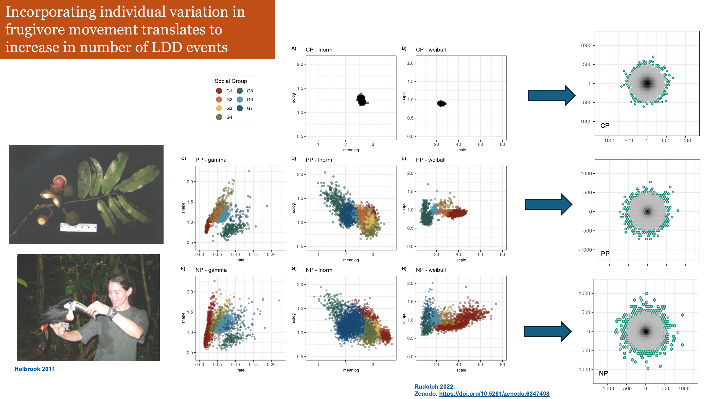
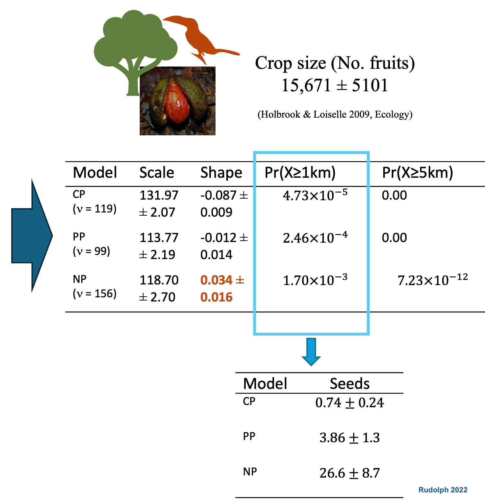

## Averages Hide the Story {background-color="#ffffff"}

:::: {.columns}

::: {.column width="50%"}
- Bolnick and colleagues looked across 93 species and found that **individual specialization is widespread across taxa** - different individuals are doing different things
- Focusing on variation among individuals, not species averages, reveals the mechanisms behind seed dispersal outcomes.

{width=60%}

::: {.citation}
Bolnick et al. *The American Naturalist* 2003
:::

:::

::: {.column width="50%"}

{height="50%"} 

::: {.citation}
Zwolak. *Biological Reviews* 2018
:::
:::

::::

::: {.notes}
Individual variation in seed dispersers (personality, age, sex, specialization) shapes where seeds go and whether they survive.
The link between individual variation and seed fate runs almost entirely through movement ecology.
Focusing on variation among individuals, not species averages, reveals the mechanisms behind seed dispersal outcomes.
Convex relationship: a population with variation disperses more seeds than predicted from the mean.
Concave relationship: a population with variation disperses fewer seeds than predicted from the mean.
:::

---

## The Origin: Aracari & Seed Dispersal {background-color="#ffffff"}

:::: {.columns}

::: {.column width="55%"}
- Primary dispersers of *Virola* trees in Ecuadorian rainforest
- Most seeds land close to parent — but **rare long-distance events are not that rare** when we account for individual variation in movement
- Establishing the link with movement and LDD


::: {.citation}
Holbrook 2011 *Biotropica*
:::
:::

::: {.column width="45%"}


:::

::::

::: {.notes}
My dissertation. These birds are the primary dispersal vector for tropical trees. The biological question: where do seeds go? The statistical question: how do you characterize a rare long-distance event that you may have only seen once or twice?
:::


---

::: {.r-stretch}

:::

---

::: {.r-stretch}

:::

---

## Central Limit Theorem (CLT) & Extreme Value Theory (EVT)
### The special rules in statistics


:::: {.columns}
::: {.fragment .fade-in .column width=50%}
- CLT = gather data -> take average -> repeat many times
  - averages are normally distributed 

```{r message=FALSE}
# Set the random seed for reproducibility
set.seed(27)

# Generate a non-normally distributed population
population <- runif(5000, min = 0, max = 1)

# Create a histogram of the population
par(mfrow = c(1, 2))  # Set up a 1x2 grid for plotting

# Plot the histogram of the population
hist(population, breaks = 30, prob = TRUE, main = "Population Distribution",
     xlab = "Value", col = "deepskyblue4")

# Step 2 and 3: Draw random samples and calculate sample means
sample_size <- 30
num_samples <- 300

# Empty vector to store sample means
sample_means <- c()

for (i in 1:num_samples) {
  # Take a random sample
  sample <- sample(population, size = sample_size, replace = TRUE)
  
  # Calculate the mean of the sample
  sample_means[i] <- mean(sample)
}

# For sample
x_bar <- mean(sample_means)
std <- sd(sample_means)

# print('Sample Mean and Variance')
# print(x_bar)
# print(std**2)

# For Population
mu <- mean(population)
sigma <- sd(population)

# print('Population Mean and Variance')
# print(mu)
# print((sigma**2)/sample_size)

# Plot the histogram of sample means
hist(sample_means, breaks = 30, prob = TRUE, main = "Distribution of Sample Means",
     xlab = "Sample Mean", col = "gold3")

# Overlay density curves
curve(dnorm(x, mean = x_bar, sd = std), col = "black", lwd = 2, add = TRUE)
# curve(dnorm(x, mean = mu, sd = sigma^2), col = "red", lwd = 2, add = TRUE)

# Add labels and legends
legend("topright", legend = c("Distribution Curve"),
       col = c("black"), lwd = 2)

# Reset the plot layout
par(mfrow = c(1, 1))
```

::: {.citation}
The Central Limit theorem states that the distribution of sample means approaches a normal distribution as the sample size increases, regardless of the population's original distribution.
:::
:::

::: {.fragment .fade-in .column width=50%}
::: {.key-insight}
Extreme Value Theory states that regardless of the underlying data-generating process, the behavior of extreme observations — the rare, large events in the tail — converges to a Generalized Extreme Value distribution. **The tail has its own universal structure.**
:::

```{r}
set.seed(27)
# Same population — exponential, heavy right tail, definitely not normal
# population <- rexp(5000, rate = 1)
# population <- rnorm(5000)
population <- runif(5000, min = 0, max = 1)

par(mfrow = c(1, 2))

# Left panel: the underlying population
# Plot the histogram of the population
hist(population, breaks = 30, prob = TRUE, main = "Population Distribution",
     xlab = "Value", col = "deepskyblue4")

# Right panel: distribution of block maxima
block_size  <- 30
num_blocks  <- 500
block_maxima <- numeric(num_blocks)

for (i in 1:num_blocks) {
  block_maxima[i] <- max(sample(population, size = block_size, replace = TRUE))
}

hist(block_maxima, breaks = 30, prob = TRUE,
     main = "Distribution of Block Maxima",
     xlab = "Maximum value", col = "darkorange3", border = "white")

# Fit and overlay a GEV curve using evd package
if (requireNamespace("evd", quietly = TRUE)) {
  fit <- evd::fgev(block_maxima)
  loc   <- fit$estimate["loc"]
  scale <- fit$estimate["scale"]
  shape <- fit$estimate["shape"]
  curve(evd::dgev(x, loc = loc, scale = scale, shape = shape),
        col = "black", lwd = 2, add = TRUE)
  legend("topright", legend =  paste0("GEV fit  |  ξ = ", round(shape, 2)), col = "black", lwd = 2)
}

par(mfrow = c(1, 1))
```

```{r eval=FALSE}
set.seed(27)
# Heavy-tailed population — lognormal works well visually
population <- rlnorm(10000, meanlog = 0, sdlog = 1)

par(mfrow = c(1, 2))

# Left panel: full population with threshold marked
u <- quantile(population, 0.90)  # 90th percentile as threshold

hist(population, breaks = 60, prob = TRUE,
     main = "Population Distribution",
     xlab = "Value", col = "deepskyblue4", border = "white",
     xlim = c(0, 12))
abline(v = u, col = "darkorange3", lwd = 2, lty = 2)
legend("topright", legend = paste0("Threshold u = ", round(u, 2)),
       col = "darkorange3", lwd = 2, lty = 2)

# Right panel: exceedances above threshold
exceedances <- population[population > u] - u

hist(exceedances, breaks = 30, prob = TRUE,
     main = "Threshold Exceedances",
     xlab = "Excess above threshold (x − u)",
     col = "darkorange3", border = "white")

# Fit and overlay GPD
if (requireNamespace("evd", quietly = TRUE)) {
  fit <- evd::fpot(population, threshold = u)
  scale <- fit$estimate["scale"]
  shape <- fit$estimate["shape"]
  curve(evd::dgpd(x, loc = 0, scale = scale, shape = shape),
        col = "black", lwd = 2, add = TRUE)
  legend("topright",
         legend = paste0("GPD fit\nξ = ", round(shape, 2)),
         col = "black", lwd = 2)
}

par(mfrow = c(1, 1))
```

:::
::::

---

:::: {.columns}

::: {.fragment .fade-in .column width=45%}

:::

::: {.column width=2%}
:::

::: {.fragment .fade-in .column width=52%}

:::

::::


---

## Incorporating Individual Variation Increases LDD Events {background-color="#ffffff"}

:::: {.columns}

::: {.column width="50%"}
::: {.placeholder-box}
[PLACEHOLDER: Movement tracks — slow vs fast individuals (scatter/line plot)]
:::
::: {.placeholder-box}
[PLACEHOLDER: Seed shadow comparison — pooled vs individual kernels]
:::
:::

::: {.column width="50%"}
::: {.placeholder-box}
[PLACEHOLDER: LDD probability comparison figure — no pooling vs complete pooling]
:::

::: {.stat-callout}
**Crop size: 15,671 ± 5,101 fruits**  
Small probabilities × large crop = many long-distance seeds
:::

::: {.citation}
Holbrook & Loiselle 2009 *Ecology* · Rudolph 2022
:::
:::

::::

::: {.notes}
Consequences of individual variation in animal movement — in frugivores, it translates to an increase in the number of long-distance seed dispersal events.

We know there is a link from mechanism to outcome. Now we need a framework.
:::

---

## Shifting Focus: From the Whole Kernel to the Tail {background-color="#ffffff"}

:::: {.columns}

::: {.column width="55%"}
Standard kernel fitting — even with individual variation — is still trying to describe **the whole distribution**.

**EVT says:** stop trying to fit the whole thing. Focus only on the tail, where it matters. Let the data above a threshold speak for themselves.

- **Block maxima** → Generalized Extreme Value distribution
- **Peaks over Threshold** → Generalized Pareto Distribution

::: {.citation}
García & Borda-de-Água *Journal of Ecology* 2017
:::
:::

::: {.column width="45%"}
::: {.placeholder-box}
[PLACEHOLDER: Weibull fit vs GPD threshold fit comparison — from dissertation figures]
:::
::: {.placeholder-box}
[PLACEHOLDER: Generalized Pareto fits at different thresholds]
:::
:::

::::

::: {.notes}
Standard kernel fitting is still trying to describe the whole distribution. EVT says: stop trying to fit the whole thing. Focus only on the tail, where it matters. Let the data above a threshold speak for themselves.
:::

---

## What is the Central Limit Theorem? {background-color="#ffffff"}

<iframe src="https://javirudolph.shinyapps.io/CLT_101/" 
        width="100%" height="600px" 
        frameborder="0">
</iframe>

## What is Extreme Value Theory? {background-color="#0E2841" .white-text}

:::: {.columns}

::: {.column width="50%"}
### The Central Limit Theorem
No matter what your data look like, if you take enough samples and calculate their averages — those averages will follow a **normal distribution**.

*It's why the bell curve is everywhere in statistics.*

::: {.placeholder-box-dark}
[PLACEHOLDER: CLT figure — uniform population → converging means]
:::
:::

::: {.column width="50%"}
### But what about extremes?
We rarely care about the average flood, the average wildfire, the average long-distance dispersal event.

**EVT is the parallel theorem for maxima.** No matter what your data look like, the distribution of extreme values converges to one of three known families — the **Generalized Extreme Value distribution**.

The shape parameter **ξ** tells you everything:

::: {.xi-table}
| ξ < 0 | Bounded tail (Weibull) |
|-------|------------------------|
| ξ = 0 | Thin tail (Gumbel) |
| **ξ > 0** | **Fat tail (Fréchet) — power law** |
:::
:::

::::

::: {.timeline-bar}
**1928** Fisher & Tippett theorem · **1993** Gaines & Denny — first call for EVT in ecology · **2005** Katz et al. — EVT still underused · **2017** García & Borda-de-Água — first formal application to dispersal kernels · **This talk** — movement → disease
:::

::: {.notes}
WHAT IS EXTREME VALUE THEORY?

The Central Limit Theorem says if you calculate averages, they converge to a Gaussian — regardless of the underlying distribution. That's why it's so useful.

EVT is the parallel theorem for maxima. The Fisher-Tippett-Gnedenko theorem (1928, fully proven 1943) says maxima converge to the GEV — also regardless of the underlying distribution.

Ecology has known it needed this tool since 1993. It's taken us this long to start using it seriously.
:::

---

## EVT Applied to Dispersal: García & Borda-de-Água 2017 {background-color="#ffffff"}

:::: {.columns}

::: {.column width="55%"}
- LDD events are **extreme values of a dispersal function** — EVT is designed for exactly this
- Seed dispersal in *Prunus mahaleb*: above threshold, seeds fit a **fat-tailed Pareto** (ξ > 0)
- Estimated Pr(seed reaches 10 km) = 7 × 10⁻⁵ — small, but biologically consequential at crop sizes of thousands of seeds
- EVT gives a **quantitative, objective definition of LDD** — not an arbitrary percentile

::: {.quote-block}
*"Dispersal ecologists can take the most of their dispersal distance records by applying statistics of extremes."*
:::

::: {.citation}
García & Borda-de-Água *Journal of Ecology* 2017
:::
:::

::: {.column width="45%"}
::: {.placeholder-box}
[PLACEHOLDER: García Fig 1 — range of dispersal distances + EVT extrapolation]
:::
::: {.placeholder-box}
[PLACEHOLDER: García Fig 3 — fitted GPD to seed dispersal distances]
:::
:::

::::

::: {.notes}
García and Borda-de-Água showed that if you treat long-distance dispersal events as exactly what they are — extremes — you can estimate probabilities of dispersal distances you never observed in your study. That's the power of EVT. And that's exactly what I did with my aracari data.
:::

---

## My Results: EVT Applied to Aracari Movement {background-color="#ffffff"}

:::: {.columns}

::: {.column width="55%"}
- Fit Generalized Pareto to the tail of simulated seed shadows
- **ξ > 0** — fat tail — confirmed under individual variation model
- Conditional probability of a seed reaching beyond 500 m, 1 km — **meaningfully higher under individual variation than pooled model**
- EVT gave me a number where standard kernel fitting gave me noise

::: {.stat-callout}
**The individual variation model doesn't just fit better —  
it changes the biological conclusion about  
how connected forests actually are.**
:::

::: {.citation}
Rudolph 2022 · Holbrook & Loiselle 2009
:::
:::

::: {.column width="45%"}
::: {.placeholder-box}
[PLACEHOLDER: GPD fit to aracari seed shadow tail — with confidence intervals]
:::
::: {.placeholder-box}
[PLACEHOLDER: Conditional probability plot — pooled vs individual variation]
:::
:::

::::

::: {.notes}
When I allow individual variation in frugivore movement, I get more long-distance dispersal events in my simulated seed shadows.
I fit a Generalized Pareto to the tail of those simulated kernels.
The shape parameter ξ > 0 — fat tail — and the conditional probability of a seed reaching beyond 500m, 1km, is meaningfully higher under individual variation than under the pooled model.
:::

---

## The Gap in Disease Ecology {background-color="#0E2841" .white-text}

:::: {.columns}

::: {.column width="50%"}
### What Lloyd-Smith et al. 2005 showed
✓ Individual ν (reproductive number) is highly overdispersed  
✓ Negative binomial offspring distribution captures heterogeneity  
✓ Small dispersion parameter *k* → superspreading dominates

### What they left unanswered
✗ **WHY** is ν overdispersed in wildlife systems?  
✗ Can we **predict** it BEFORE an outbreak?

::: {.citation-light}
Lloyd-Smith et al. *Nature* 2005
:::
:::

::: {.column width="50%"}
### The Answer

::: {.cascade-block}
**Heavy-tailed movement**  
↓  
heavy-tailed contact distribution  
↓  
heavy-tailed offspring distribution  
↓  
**superspreading**
:::

::: {.arrow-callout}
ξ from telemetry data  
↓  
**Predicts *k* before any outbreak data exist**
:::

Movement data as **early-warning**  
for disease outbreak potential
:::

::::

::: {.notes}
Lloyd-Smith 2005 is the landmark paper. They showed individual variation in infectiousness is real and consequential. But they treated it statistically — not mechanistically. For wildlife, the mechanism is movement. Heavy-tailed movement generates heavy-tailed contact distributions, which generate heavy-tailed offspring distributions. Xi from GPS data predicts k before a pathogen is even detected.
:::

---

## One Framework, Three Scales {background-color="#ffffff"}

:::: {.columns}

::: {.column width="40%"}
Three kernels — each shaped by the tail of the one before:

**Individual Movement Kernel**  
Estimated from GPS telemetry — *this is what you can measure today*

↓

**Pathogen Dispersal Kernel**  
Movement × contact probability = where transmission occurs

↓

**Outbreak Spread Kernel**  
Population-level dynamics — whether an epidemic stays local or jumps

::: {.key-insight}
The EVT shape parameter **ξ** from tracking data propagates predictive power through the entire cascade
:::
:::

::: {.column width="60%"}
::: {.placeholder-box-tall}
[PLACEHOLDER: Three-scale cascade diagram — individual kernel → pathogen kernel → outbreak kernel, with ξ propagating through]
:::
:::

::::

::: {.notes}
The formal architecture. You start with what you can measure: individual movement distances from GPS tracking. Combined with contact probability as a function of distance, you get the pathogen dispersal kernel. Aggregated across the population, you get outbreak spread. The fat or thin tail propagates forward through every step. Xi is estimated once, from tracking data, and gives you information about all three levels.
:::

---

## Preliminary Results: Simulations {background-color="#ffffff"}

:::: {.columns}

::: {.column width="45%"}
**Populations with fat vs. thin-tailed movement kernels**  
Same mean movement · Same R₀

::: {.findings-block}
**Fat-tailed populations:**  
→ Greater variance in outbreak size  
→ Larger maximum outbreaks  
→ Faster spatial spread velocity

**Threshold behavior:**  
→ ξ crossing zero = qualitative shift, not just quantitative

**Key:**  
→ Detectable at realistic telemetry sample sizes
:::

*Work in progress — simulations ongoing*
:::

::: {.column width="55%"}
::: {.placeholder-box-tall}
[PLACEHOLDER: Simulation figure — outbreak size distributions under homogeneous / gamma / Lomax dispersion; spatial spread comparison]
:::
:::

::::

::: {.notes}
Preliminary simulations: populations with identical mean movement distances and identical R0, but different tail shapes. Fat-tailed populations show dramatically higher variance in outbreak size, larger maximum outbreaks, faster spread — even though average behavior is identical. Crossing from thin to fat tail produces a qualitative change. And this signal is detectable at realistic sample sizes for wildlife tracking studies.
:::

---

## Where the Framework Goes: American Mink in Chile {background-color="#ffffff"}

:::: {.columns}

::: {.column width="50%"}
**American Mink (*Neovison vison*)**  
Invasive semiaquatic carnivore in Chilean Patagonia

- Disperses along river networks — a tractable 1-D dispersal problem
- Documented hosts: canine distemper, parvovirus, Aleutian disease
- Potential bridge host to native species: coypu, pudú, South Andean deer
- Watershed-following movement generates heavy tails — **the biological justification for the Lomax**

::: {.question-block}
*Does the tail of mink movement along river corridors predict pathogen spread potential and spillover risk to native species?*

GPS tracking + pathogen surveillance + EVT → testable predictions before any outbreak
:::
:::

::: {.column width="50%"}
::: {.placeholder-box}
[PLACEHOLDER: Map — mink invasion range in Chilean Patagonia river networks]
:::
::: {.placeholder-box}
[PLACEHOLDER: Photo — American mink]
:::
:::

::::

::: {.notes}
American mink in Chilean waterways — invasive, semiaquatic, dispersing along river networks. This is a tractable one-dimensional dispersal problem. They carry pathogens and are positioned to act as bridge hosts. The question is whether the tail of their movement kernel predicts pathogen spread potential before outbreak data exist.
:::
