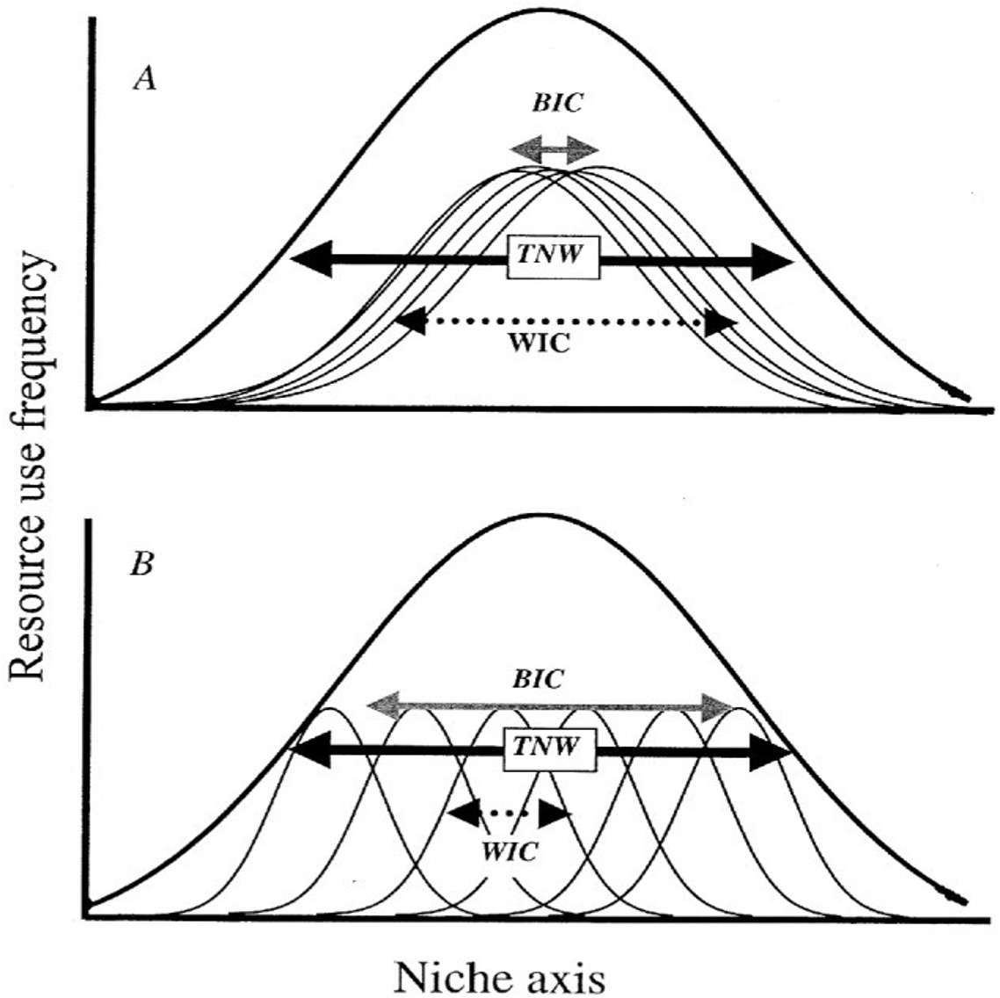
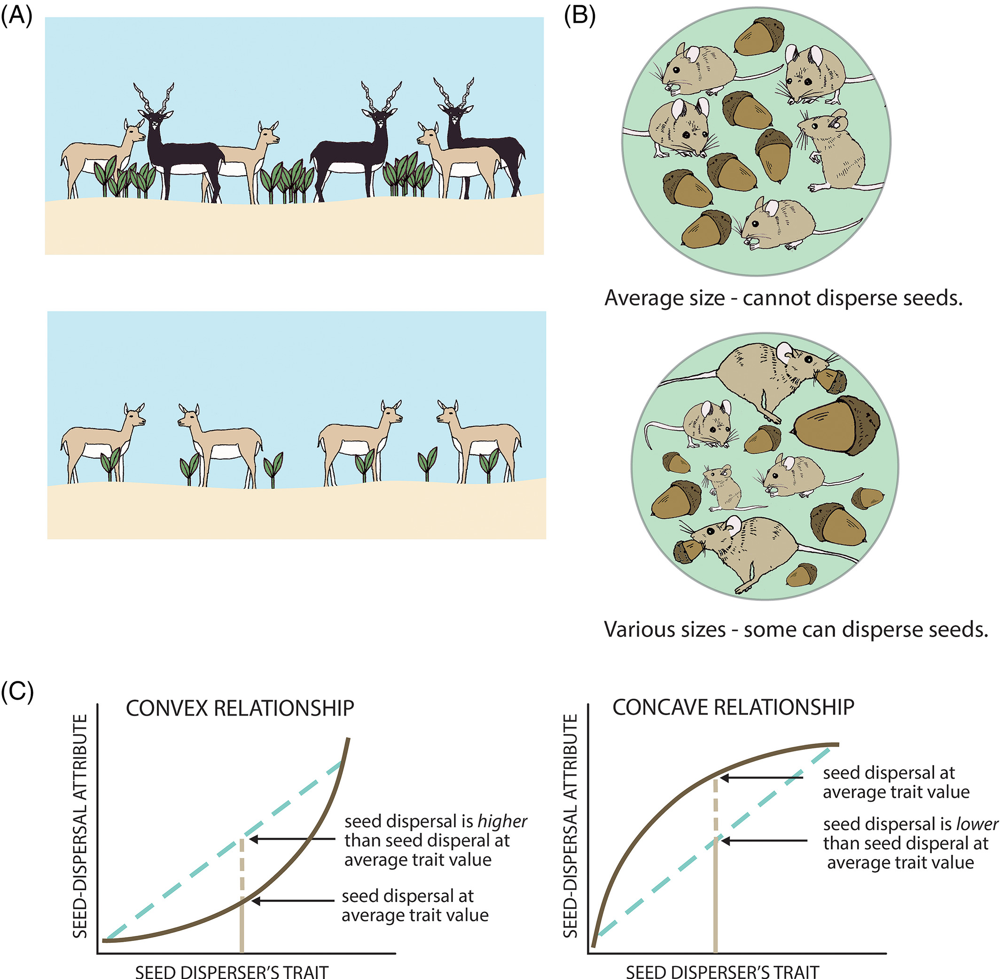
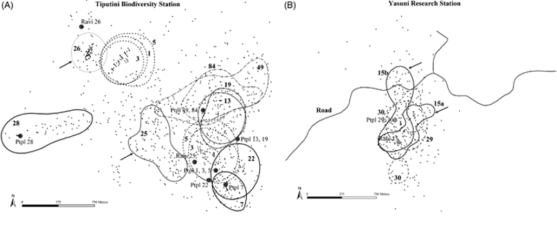
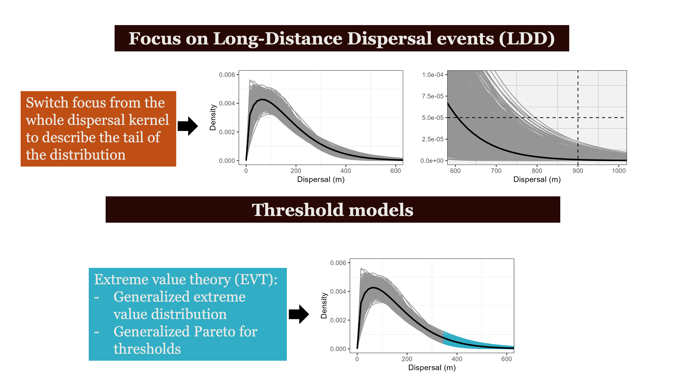
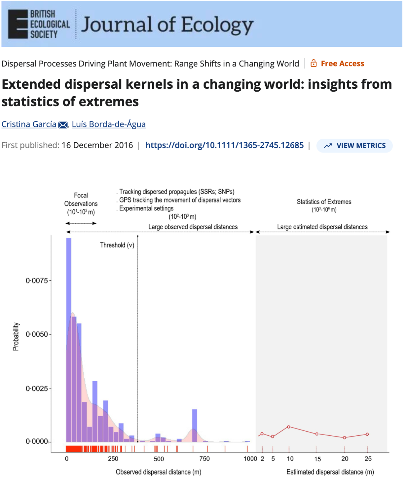
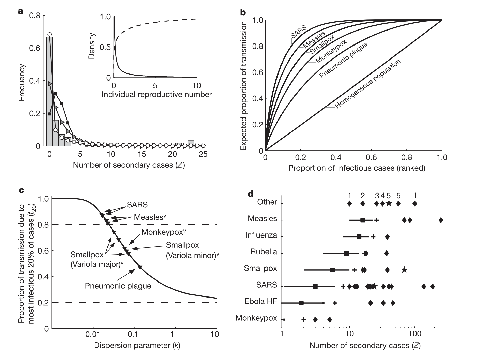

## How does a computational ecologist end up in a library? {background-color="#ffffff"}

**The path:** PhD in Zoology -> Postdocs at USGS & EPI -> Libraries

. . .

**The position:** Assistant University Librarian for Computational Literacy  
*UF's first computational literacy position*

. . .

**The mission:** Build computational research infrastructure and capacity across campus — from individual consultations to campus-wide workshops, and teaching. 

. . .

::: {.key-insight}
**The combination:** Active research in disease ecology + expertise in teaching computational methods + ability to translate between domains.
:::

::: {.notes}
I want to start by addressing what might seem like an unusual combination: a computational ecologist in a library position. This is UF's first tenure-track librarian position focused on computational literacy, and it exists because libraries are recognizing that computational skills are now foundational infrastructure for research.

My role bridges active research in disease ecology with building capacity through workshops, consulting, and educational materials.
:::

---

## What is computational literacy? {background-color="#ffffff"}

> "Computation is not merely a tool for more efficient instruction, but the basis for a new literacy that changes how people think and learn."  
> — diSessa (2000)

. . .

::: {.question-block}

**The gap:** Most students can execute code they don't understand  
**The goal:** Move fluently between biological meaning, mathematical formulation, and computational implementation

:::

. . .

Computational literacy is the ability to **think with computation** — to use it as a medium for scientific reasoning, like written language or mathematics. 
  
. . .  

::: {.citation}
diSessa (2000) *Changing Minds: Computers, Learning, and Literacy*  
Papert (1980) *Mindstorms: Children, Computers, and Powerful Ideas*  
Wing (2006) "Computational Thinking" *Communications of the ACM*  
Weintrop et al. (2016) "Defining Computational Thinking for Mathematics and Science" *Journal of Science Education and Technology*
:::

::: {.notes}
Computational literacy is distinct from software training. It is the ability to think with computation, to use it as a medium for scientific reasoning. In ecology and disease biology, this means being able to translate between what's happening biologically, how that is formalized mathematically, and how that is implemented computationally.

The additional citations ground this in the literature: Papert's constructionism, Wing's computational thinking framework, and Weintrop's work specifically connecting it to science education.
:::

---


<iframe 
  src="https://javirudolph.github.io/ecoSIR-modules/" 
  width="100%" 
  height="700px" 
  frameborder="0"
  allowfullscreen>
</iframe>

---

## {background-color="#ffffff"}

::: {style="text-align: center; padding-top: 3em;"}

::: {style="font-size: 2.2em; font-weight: 700; color: #0E2841; margin-bottom: 0.8em;"}
What about research?
:::

::: {style="font-size: 1.3em; color: #156082; line-height: 1.6;"}
Educational infrastructure is one output. Active research is the other.
:::

:::

---

## Averages hide the story {background-color="#ffffff"}

:::: {.columns}

::: {.fragment .fade-in .column width="50%"}

{width=60%}

- Bolnick and colleagues looked across 93 species and found that **individual specialization is widespread across taxa** - different individuals are doing different things

::: {.citation}
Bolnick et al. *The American Naturalist* 2003
Bolnick et al. *TREE* 2011
:::


:::

::: {.fragment .fade-in .column width="50%"}
- Focusing on variation among individuals, not species averages, reveals the mechanisms behind seed dispersal outcomes.

{height="50%"} 


::: {.citation}
Zwolak. *Biological Reviews* 2018
:::
:::

::::

::: {.notes}
Individual variation in seed dispersers (personality, age, sex, specialization) shapes where seeds go and whether they survive.
The link between individual variation and seed fate runs almost entirely through movement ecology.
Focusing on variation among individuals, not species averages, reveals the mechanisms behind seed dispersal outcomes.
Convex relationship: a population with variation disperses more seeds than predicted from the mean.
Concave relationship: a population with variation disperses fewer seeds than predicted from the mean.
:::

---

## The Origin: Aracari & Seed Dispersal {background-color="#ffffff"}

:::: {.columns}

::: {.column width="55%"}
- Primary dispersers of *Virola* trees in Ecuadorian rainforest
- Most seeds land close to parent — but **rare long-distance events are not that rare** when we account for individual variation in movement
- Establishing the link with movement and LDD




::: {.citation}
Holbrook 2011 *Biotropica*
:::
:::

::: {.column width="45%"}


:::

::::

::: {.notes}
My dissertation. These birds are the primary dispersal vector for tropical trees. The biological question: where do seeds go? The statistical question: how do you characterize a rare long-distance event that you may have only seen once or twice?
:::


---

::: {.r-stretch}

:::

---

::: {.r-stretch}

:::

---

:::: {.columns}

::: {.fragment .fade-in .column width=45%}

:::

::: {.column width=2%}
:::

::: {.fragment .fade-in .column width=52%}

:::
::::

::: {.notes}

García and Borda-de-Água showed that if you treat long-distance dispersal events as exactly what they are — extremes — you can estimate probabilities of dispersal distances you never observed in your study. That's the power of EVT. And that's exactly what I did with my aracari data.

When I allow individual variation in frugivore movement, I get more long-distance dispersal events in my simulated seed shadows.
I fit a Generalized Pareto to the tail of those simulated kernels.
The shape parameter ξ > 0 — fat tail — and the conditional probability of a seed reaching beyond 500m, 1km, is meaningfully higher under individual variation than under the pooled model.

Consequences of individual variation in animal movement — in frugivores, it translates to an increase in the number of long-distance seed dispersal events.

We know there is a link from mechanism to outcome. Now we need a framework.

Standard kernel fitting is still trying to describe the whole distribution. EVT says: stop trying to fit the whole thing. Focus only on the tail, where it matters. Let the data above a threshold speak for themselves.
:::

---

## Central Limit Theorem (CLT) & Extreme Value Theory (EVT)
### The special rules in statistics

:::: {.columns}
::: {.fragment .fade-in .column width=50%}
- CLT = gather data -> take average -> repeat many times
  - averages are normally distributed 

```{r message=FALSE}
# Set the random seed for reproducibility
set.seed(27)

# Generate a non-normally distributed population
population <- runif(5000, min = 0, max = 1)

# Create a histogram of the population
par(mfrow = c(1, 2))  # Set up a 1x2 grid for plotting

# Plot the histogram of the population
hist(population, breaks = 30, prob = TRUE, main = "Population Distribution",
     xlab = "Value", col = "deepskyblue4")

# Step 2 and 3: Draw random samples and calculate sample means
sample_size <- 30
num_samples <- 300

# Empty vector to store sample means
sample_means <- c()

for (i in 1:num_samples) {
  # Take a random sample
  sample <- sample(population, size = sample_size, replace = TRUE)
  
  # Calculate the mean of the sample
  sample_means[i] <- mean(sample)
}

# For sample
x_bar <- mean(sample_means)
std <- sd(sample_means)

# print('Sample Mean and Variance')
# print(x_bar)
# print(std**2)

# For Population
mu <- mean(population)
sigma <- sd(population)

# print('Population Mean and Variance')
# print(mu)
# print((sigma**2)/sample_size)

# Plot the histogram of sample means
hist(sample_means, breaks = 30, prob = TRUE, main = "Distribution of Sample Means",
     xlab = "Sample Mean", col = "gold3")

# Overlay density curves
curve(dnorm(x, mean = x_bar, sd = std), col = "black", lwd = 2, add = TRUE)
# curve(dnorm(x, mean = mu, sd = sigma^2), col = "red", lwd = 2, add = TRUE)

# Add labels and legends
legend("topright", legend = c("Distribution Curve"),
       col = c("black"), lwd = 2)

# Reset the plot layout
par(mfrow = c(1, 1))
```

::: {.citation}
The Central Limit theorem states that the distribution of sample means approaches a normal distribution as the sample size increases, regardless of the population's original distribution.
:::
:::

::: {.fragment .fade-in .column width=50%}
::: {.key-insight}
Extreme Value Theory states that regardless of the underlying data-generating process, the behavior of extreme observations — the rare, large events in the tail — converges to a Generalized Extreme Value distribution. **The tail has its own universal structure.**
:::

```{r}
set.seed(27)
# Same population — exponential, heavy right tail, definitely not normal
# population <- rexp(5000, rate = 1)
# population <- rnorm(5000)
population <- runif(5000, min = 0, max = 1)

par(mfrow = c(1, 2))

# Left panel: the underlying population
# Plot the histogram of the population
hist(population, breaks = 30, prob = TRUE, main = "Population Distribution",
     xlab = "Value", col = "deepskyblue4")

# Right panel: distribution of block maxima
block_size  <- 30
num_blocks  <- 500
block_maxima <- numeric(num_blocks)

for (i in 1:num_blocks) {
  block_maxima[i] <- max(sample(population, size = block_size, replace = TRUE))
}

hist(block_maxima, breaks = 30, prob = TRUE,
     main = "Distribution of Block Maxima",
     xlab = "Maximum value", col = "darkorange3", border = "white")

# Fit and overlay a GEV curve using evd package
if (requireNamespace("evd", quietly = TRUE)) {
  fit <- evd::fgev(block_maxima)
  loc   <- fit$estimate["loc"]
  scale <- fit$estimate["scale"]
  shape <- fit$estimate["shape"]
  curve(evd::dgev(x, loc = loc, scale = scale, shape = shape),
        col = "black", lwd = 2, add = TRUE)
  legend("topright", legend =  paste0("GEV fit  |  ξ = ", round(shape, 2)), col = "black", lwd = 2)
}

par(mfrow = c(1, 1))
```

```{r eval=FALSE}
set.seed(27)
# Heavy-tailed population — lognormal works well visually
population <- rlnorm(10000, meanlog = 0, sdlog = 1)

par(mfrow = c(1, 2))

# Left panel: full population with threshold marked
u <- quantile(population, 0.90)  # 90th percentile as threshold

hist(population, breaks = 60, prob = TRUE,
     main = "Population Distribution",
     xlab = "Value", col = "deepskyblue4", border = "white",
     xlim = c(0, 12))
abline(v = u, col = "darkorange3", lwd = 2, lty = 2)
legend("topright", legend = paste0("Threshold u = ", round(u, 2)),
       col = "darkorange3", lwd = 2, lty = 2)

# Right panel: exceedances above threshold
exceedances <- population[population > u] - u

hist(exceedances, breaks = 30, prob = TRUE,
     main = "Threshold Exceedances",
     xlab = "Excess above threshold (x − u)",
     col = "darkorange3", border = "white")

# Fit and overlay GPD
if (requireNamespace("evd", quietly = TRUE)) {
  fit <- evd::fpot(population, threshold = u)
  scale <- fit$estimate["scale"]
  shape <- fit$estimate["shape"]
  curve(evd::dgpd(x, loc = 0, scale = scale, shape = shape),
        col = "black", lwd = 2, add = TRUE)
  legend("topright",
         legend = paste0("GPD fit\nξ = ", round(shape, 2)),
         col = "black", lwd = 2)
}

par(mfrow = c(1, 1))
```

:::
::::

::: {.notes}
WHAT IS EXTREME VALUE THEORY?

The Central Limit Theorem says if you calculate averages, they converge to a Gaussian — regardless of the underlying distribution. That's why it's so useful.

EVT is the parallel theorem for maxima. The Fisher-Tippett-Gnedenko theorem (1928, fully proven 1943) says maxima converge to the GEV — also regardless of the underlying distribution.

Ecology has known it needed this tool since 1993. It's taken us this long to start using it seriously.
:::


---

## EVT {background-color="#ffffff"}

<iframe
  src="https://javirudolph.shinyapps.io/EVT_101/"
  width="100%"
  height="700px"
  frameborder="0"
  allowfullscreen>
</iframe>
---

## Why EVT matters for ecology {background-color="#ffffff"}

**EVT has been used successfully in other fields:**

:::: {.columns}

::: {.fragment .fade-in .column width="50%"}

**Hydrology:**
- Predicting 100-year floods from 30 years of data
- Estimating extreme rainfall events
- Infrastructure design under climate change
- Hurricanes

**Finance:**
- Risk assessment
- Portfolio stress testing
- Estimating probability of catastrophic losses

::: {.citation}
Katz, Parlange & Naveau (2002) *Advances in Water Resources*
S. Coles (2001) *An Introduction to Statistical Modeling of Extreme Values*
:::

:::

::: {.fragment .fade-in .column width="50%"}

**In ecology, rare events matter disproportionately**

::: {.key-insight}
**The payoff:** EVT lets you predict the probability of events you haven't witnessed yet from the data you have (focusing on the tail).

:::

::: {.citation}
Gaines & Denny (1993) *Ecology*  
Katz et al. (2005) *Ecology*    
Gutschick & BassiriRad (2003) *New Phytologist*  
:::

:::

::::

::: {.notes}
EVT has been used successfully in hydrology for decades — they've been predicting 100-year floods from 30 years of stream gauge data since the 1970s. Finance uses it for tail risk. The logic is the same: you need to estimate the probability of catastrophic events from limited observations.

In ecology, rare events often have outsized consequences. A single long-distance dispersal event can establish a new population. A single superspreading event can spark an outbreak. EVT gives us the mathematical machinery to formalize those predictions.
:::

---


## Process and Pattern {background-color="#ffffff"}

::: {.center-content}

### Individual variation in movement shapes the tail of the dispersal kernel —  
### and we can use ξ (shape) to see this

:::

:::: {.columns}

::: {.fragment .fade-in .column width="33%"}
::: {.key-insight}
**The process**  
Individual frugivores differ in how far they move. Some are homebodies. Some are explorers. That variation is not just noise, it is the mechanism.
:::
:::

::: {.fragment .fade-in .column width="33%"}
::: {.key-insight}
**The pattern**  
Pooled models underestimate long-distance dispersal. When individual variation is modeled explicitly, the tail of the seed shadow is fatter — and ξ > 0 confirms it.
:::
:::

::: {.fragment .fade-in .column width="33%"}
::: {.key-insight}
**The link**  
ξ is not a fitting artifact. It is a fingerprint of the movement process. The shape of the seed dispersal tail traces back to how individuals move and how we capture variation across individuals.
:::
:::

::::


::: {.fragment .fade-in .citation}
Snell, ...[Rudolph] et al. (2019) *Consequences of intraspecific variation in seed dispersal for plant demography, communities, evolution and global change*
:::


::: {.notes}
This is the pivot. Everything before — EVT, individual variation, the aracari system — was building to this point.

The argument is simple: ξ is not arbitrary. It reflects something real about how individuals move. When you allow individuals to differ, the resulting seed shadow has a fat tail, and the shape parameter you recover from fitting EVT to that tail traces back to the biological mechanism.

This is what justifies the next move — taking that same logic into disease systems. If ξ encodes movement process in seed dispersal, it encodes transmission process in pathogen dispersal. Same mathematics, new biological context.

When I allow individual variation in frugivore movement, I get more long-distance dispersal events in my simulated seed shadows.
I fit a Generalized Pareto to the tail of those simulated kernels.
The shape parameter ξ > 0 — fat tail — and the conditional probability of a seed reaching beyond 500m, 1km, is meaningfully higher under individual variation than under the pooled model.
:::

---

## Similar question, different system {background-color="#0E2841" .white-text}

:::: {.columns}

::: {.fragment .fade-in .column width="50%"}

**Seed dispersal:**

Individual birds differ in how far they move  
- Some seeds travel farther than predicted from the average  
- Rare long-distance events shape forest structure  
- **EVT quantifies the tail of the dispersal kernel**

:::

::: {.fragment .fade-in .column width="50%"}

**Disease transmission:**

Individual hosts differ in how many others they infect  
- Some outbreaks are larger than predicted from R₀  
- Rare superspreading events drive epidemic dynamics  
- **Can EVT quantify the tail of the transmission process?**

:::

::::

. . .

::: {.key-insight}
If movement heterogeneity generates fat-tailed seed shadows, does movement heterogeneity generate fat-tailed outbreak sizes?
:::

::: {.notes}
This is the pivot slide. Everything up to here has been about seed dispersal. Now we make the move to disease.

The argument is that these are not separate problems. They are the same statistical and mechanistic structure applied to different biological systems. Individual variation in movement shapes rare long-distance dispersal events. Individual variation in transmission shapes rare superspreading events. EVT is the formal machinery that connects them.
:::

---

## Individual Variation in Disease Transmission {background-color="#1a4369" .white-text}

:::: {.columns}

::: {.column width="50%"}

::: {.citation-light}
"Population-level analyses often use average quantities to describe heterogeneous systems..."  
— Lloyd-Smith et al. Nature 2005
:::

### Sound familiar?

$R_0$ is an average. It hides the same individual variation we saw in dispersal kernels:

- Most individuals infect zero or one
- A few infect many — **superspreaders**

::: {.key-insight}
Individual reproductive number, $\nu$, as a random variable representing the expected number of secondary cases caused by a particular infected individual.
:::


:::

::: {.column width="50%"}
::: {.fragment .fade-in}

:::
:::
  
::::

::: {.fragment .fade-in}


- Same $R_0$, six different epidemiological worlds.
- More heterogeneity means more outbreaks die out, but the ones that don't are explosive.
- **k describes the shape of that individual variation**
:::


::: {.notes}
The opening quote of Lloyd-Smith is the same argument I've been making about seed dispersal for the last five slides. Population averages hide the mechanism. R₀ hides individual variation in infectiousness exactly the way a pooled dispersal kernel hides individual variation in movement.

Lloyd-Smith's solution was statistical — fit a distribution, estimate R0 and k. That works when you have contact tracing data, which you have for SARS, measles, smallpox. You do not have that for wildlife pathogens. You have GPS collars.

The branching process is the entire model — there is no SIR, no compartments, no population dynamics. It is a purely probabilistic model of individual-level transmission heterogeneity.

:::

---

## The Mechanistic Foundation {background-color="#ffffff"}

:::: {.columns}

::: {.column width="50%"}
**Ponciano & Capistrán (2011)** derive the incidence rate from first principles:

- An infected individual has *realized disease dispersion* $a$
- Number of successful transmission encounters $X(a)$ follows a **pure birth process**
- Probability of at least one infection:

$$P(X(a) \geq 1) = 1 - e^{-a \cdot b \cdot h(I)}$$

When dispersion effort $\Lambda$ is exponentially distributed across individuals:

$$P(X(a) \geq 1) = \int_0^\infty \left(1 - e^{-\lambda h(I)}\right) \alpha e^{-\alpha \lambda} \, d\lambda = \frac{h(I)}{h(I) + \alpha}$$

::: {.citation}
Ponciano & Capistrán. *PLoS Computational Biology* 2011
:::
:::

::: {.column width="50%"}

::: {.key-insight}
**Individual variation matters here:**  
The exponential distribution for $\Lambda$ already allows individuals to differ in how much they disperse pathogen.  
But the exponential has a **thin tail** — it does not generate superspreaders.
:::

::: {.fragment .fade-in .question-block}
*What if dispersion effort follows a heavier-tailed distribution?*  
*What if — like seed dispersers — some infected individuals are true long-distance movers?*
:::

:::

::::

::: {.notes}
Ponciano and Capistran gave us the scaffolding. The pure birth process is elegant: the probability that you produce at least one infection grows with your realized dispersion effort a. The exponential model for Lambda averages over individual heterogeneity and gives you the LHD incidence rate. But the exponential is thin-tailed — it cannot generate the kind of extreme dispersion events that produce superspreaders. We need to go one step further.
:::

---

## From Movement to Superspreaders: The Lomax Emerges {background-color="#ffffff"}

:::: {.columns}

::: {.column width="55%"}

**What if dispersion effort $a$ is itself heterogeneous?**

Allow dispersion effort $a$, to be distributed as an
exponential distribution, whose parameter is sampled from a gamma distribution: 

Let $A \sim \text{Gamma}(\theta, \tau)$ — individual variation in transmission potential — and $Y \mid A \sim \text{Exp}(A)$ — realized dispersion given that potential.

Then the marginal distribution of $Y$ is:

$$f_Y(y) = \int_0^\infty a e^{-ay} \cdot \frac{\theta^\tau}{\Gamma(\tau)} a^{\tau-1} e^{-\theta a} \, da = \frac{\tau \theta^\tau}{(y + \theta)^{\tau+1}}$$

::: {.stat-callout}
This is the **Lomax distribution** — special case of a GPD - a heavy-tailed distribution with support on $[0, \infty)$.  
The tail emerges mechanistically from the compound structure.
:::

And the probability of transmission under Lomax-distributed dispersion:

$$P(X(a) \geq 1) = \int_0^\infty \left(1 - e^{-abE}\right) \frac{\tau \theta^\tau}{(a+\theta)^{\tau+1}} \, da$$

:::

::: {.column width="45%"}

::: {.key-insight}
**The Gamma is the movement**  


$\theta$ and $\tau$ are not abstract parameters — they characterize how individuals in a population move. Some animals are homebodies, some are explorers. 

That variation across individuals, captured by the Gamma, is what drives the heavy tail.

Allow the movement to vary, and EVT drops out the other end.

:::

::: {.citation}
Rudolph & Ponciano (2025) Biorxiv | Rudolph (in.prep)
:::

:::

::::

::: {.notes}
Ponciano-Capistrán give you a first-principles framework where transmission probability depends on a dispersion effort parameter a, and they model the heterogeneity in a across individuals using an exponential distribution. 

what if we let that exponential rate itself vary? Instead of a fixed rate, you draw it from a Gamma distribution — and that Gamma is the movement. The parameters θ and τ characterize how individuals in a population move. The Gamma is biologically interpretable as the movement kernel.

when you integrate out that Gamma-distributed rate, the marginal distribution of dispersion effort is Lomax. And the Lomax is a special case of the Generalized Pareto — which is exactly the EVT family

here is a natural extension of an existing framework, and when you make this one biologically motivated move, EVT drops out the other end.

:::

---

## Simulation {background-color="#ffffff"}

<iframe 
  src="https://javirudolph.shinyapps.io/lomax_evt/" 
  width="100%" 
  height="700px" 
  frameborder="0"
  allowfullscreen>
</iframe>

---


## Where the Framework Goes: American Mink in Chile {background-color="#ffffff"}

:::: {.columns}

::: {.column width="50%"}
Invasive semiaquatic carnivore in Chilean Patagonia

- Disperses along river networks
- Documented hosts: canine distemper, parvovirus, *Mycobacterium bovis*
- Potential bridge host to native species: coypu, pudú, otters

::: {.citation}
Santibañez et.al. (2025). Frontiers in Veterinary Science  
Hernandez et.al. (2024) Acta Tropica
:::

::: {.question-block}
*How can we use mink movement along river corridors predict pathogen spread potential and spillover risk to native species?*

Short on time and lack of data = computational and simulation approach
:::
:::

::: {.column width="50%"}
  


::: {.citation}
Crego et.al. (2018). PLoS One
:::
:::

::::

::: {.notes}
American mink in Chilean waterways — invasive, semiaquatic, dispersing along river networks. This is a tractable one-dimensional dispersal problem. They carry pathogens and are positioned to act as bridge hosts. The question is whether the tail of their movement kernel predicts pathogen spread potential before outbreak data exist.
:::

---

## The proposal: Using EVT to predict unobserved extremes {background-color="#ffffff"}

:::: {.columns}

::: {.column width="50%"}


**Applications:**

- Predict pathogen spread potential *before* outbreak data exist
- Identify high-risk river segments for surveillance
- Quantify spillover risk to native species


:::

::: {.column width="50%"}

::: {.fragment}
::: {.key-insight}
**The power of EVT:**

You don't need to observe a 100 km dispersal to estimate its probability.

**Computational Literacy:**

The simulation framework is not just analysis. It is scenario exploration. It is a reasoning tool for asking “what if” questions before the system tells you the answer.
:::
:::

:::

::::

::: {.notes}
This is where the research and the computational literacy mission converge. I am building a movement simulator for mink because I need it for my research on disease spread in Patagonia. But the simulator is also a teaching tool.

When I teach workshops on simulation in disease ecology, I use this mink system as the example. When I develop educational materials on EVT, I use the seed dispersal and disease transmission examples side by side.

The research generates the materials. The materials build capacity.
:::

---


## Bringing it together: Computational literacy as infrastructure {background-color="#ffffff"}

**My role at UF Libraries:**

- Research consulting for quantitative and computational approaches in ecology
- Workshop development and instruction (R, simulation modeling, reproducibility)
- Educational materials that bridge statistics, computation, and biological mechanism
- Building partnerships for computational training (UF Global Fellows, Chile and Ecuador)


::: {.notes}
My position at UF Libraries is designed to bridge active research with educational infrastructure. I maintain a research program in disease ecology and movement modeling. I also run workshops, provide consulting, and develop educational materials.

The course with Leibold is structured as a working group where the deliverable is publishable synthesis. Students learn by doing research, not by following tutorials.

That is computational literacy. Not tool fluency. Conceptual grounding in the connection between the biological question, the statistical model, and the computational implementation.
:::

---

## What I hope you take away {background-color="#ffffff"}

:::: {.columns}

::: {.column width="50%"}

**The research message:**

- Individual variation drives population-level outcomes in seed dispersal and disease transmission
- Extreme Value Theory provides a formal framework for quantifying rare events
- Movement ecology as the mechanistic link between individual behavior and pathogen spread

:::

::: {.column width="50%"}

**The computational literacy message:**

- Computation is not a tool. It is a way of thinking.
- Building capacity for computational approaches is research infrastructure.
- The materials you develop for your own work can become the educational resources that help others build competency.

:::

::::

. . .

::: {.key-insight}
**My position exists because libraries are evolving to recognize that computational skills are foundational to research.**

:::

::: {.notes}
I want to end by tying together the research and the mission. The research on individual variation, EVT, and disease transmission is substantive and ongoing. The computational literacy work is not a side project. It is core infrastructure for how research gets done.

When I teach someone how to parameterize a dispersal kernel from telemetry data, that is computational literacy. When I help a graduate student understand what a jSDM is actually estimating, that is computational literacy. When I build an interactive Shiny app to explore parameter space in a stochastic disease model, that is computational literacy.

The position exists because libraries are evolving to recognize that computational skills are foundational to research. And I am positioned to do this work because I am both a computational ecologist who builds these tools for my own research and an educator who knows how to make them accessible to others.
:::

---

## {#thank-you background-color="#ffffff"}

::: {.thank-you-slide}

::: {.thank-you-top}
**Thank you**
:::

::: {.thank-you-divider}
:::


::: {.columns}

::: {.column width=50%}
::: {.thank-you-contact}
- Office of the Assoc. Dean of Research - UF Libraries
- Global Fellows UF International Center
- F. Hernandez Univ Austral Chile
- JM Ponciano
:::

:::

::: {.column width=50%}
{width="260px"}
:::

:::

